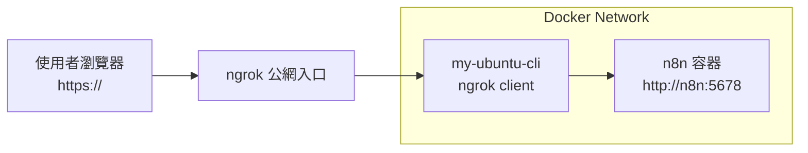
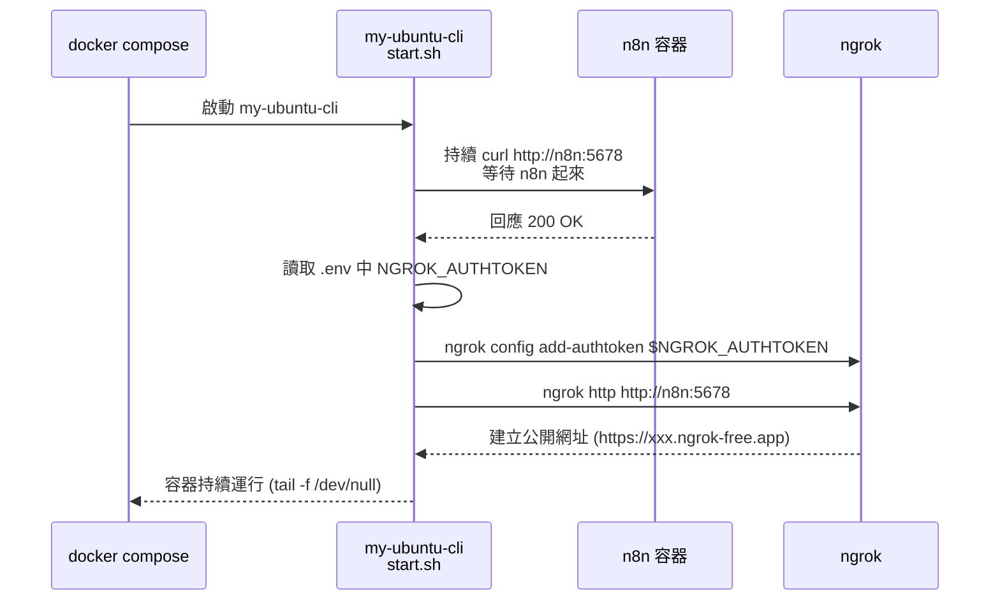
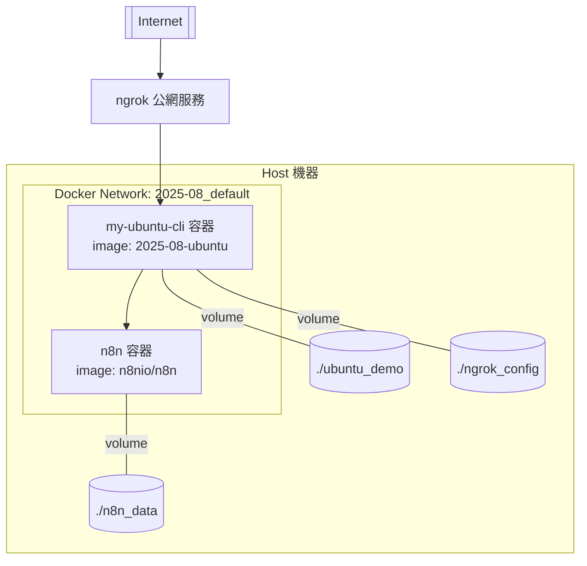

```markdown
# 🚀 n8n + Ngrok 自動化外部網域打洞環境（2025-08）

這個專案是在本地端透過 Docker Compose 建立一個可自動公開到外部網路的 n8n 操作環境。

重點功能如下：

- 使用 **Docker Compose** 建立 n8n + Ubuntu CLI 的兩個服務
- 自動等待 n8n 啟動成功
- 自動啟動 ngrok 並建立公開網址
- 使用 `.env` 管理 ngrok authtoken，避免洩漏到 GitHub
- 所有重要資料都透過 volume 持久化
- Ubuntu CLI 容器可用來做進階測試與操作（curl/ngrok 皆已安裝）
- 支援未來擴充自動更新 n8n 的 Webhook URL

---

## 📁 專案結構
```

2025-08/
├── docker-compose.yml # 主服務定義
├── .env # Ngrok authtoken 與相關設定（不會被 git push）
├── .gitignore # 保護本機敏感檔案不上傳
│
├── n8n_data/ # n8n 工作資料（外掛、workflow、帳密）
│
├── ngrok_config/ # ngrok 的設定檔（authtoken 放這裡）
│
├── ubuntu_demo/ # Ubuntu CLI 容器的持久化資料
│
└── ubuntu-cli/
├── Dockerfile # 自訂 Ubuntu CLI image 的建置流程
└── start.sh # 自動等待 n8n + 啟動 ngrok 的腳本

```

---

## 🐳 使用方式

### 1️⃣ 建立 `.env`（請勿提交到 GitHub）

專案根目錄會需要一個 `.env`：

```

NGROK_AUTHTOKEN=你的\_ngrok_authtoken
N8N_HOST=n8n
N8N_PORT=5678

````

> `.env` 已在 `.gitignore` 裡，因此不會被 push 上 GitHub。

---

### 2️⃣ 建置並啟動服務

```bash
docker compose up -d --build
````

成功後會看到兩個服務：

- `2025-08-n8n-1`（n8n）
- `my-ubuntu-cli`（自動打洞容器）

---

### 3️⃣ 查看 Ubuntu CLI 的啟動 Log

```bash
docker logs my-ubuntu-cli
```

正常會看到：

```
Container started, waiting for n8n...
n8n is reachable, curl OK.
Configure/overwrite ngrok authtoken...
Starting ngrok tunnel to http://n8n:5678 ...
```

---

### 4️⃣ 查詢 ngrok 產生的公開網址

Ubuntu CLI 裡開啟：

```bash
docker exec -it my-ubuntu-cli bash
curl http://127.0.0.1:4040/api/tunnels
```

會看到 ngrok 所映射的 URL。

---

## 🔧 技術細節

### ✔ Dockerfile

- 基於 Ubuntu 24.04
- 安裝 curl
- 安裝 ngrok（依官方方式）
- 建立 `/root/demo` 工作資料夾
- 放置 `start.sh`

### ✔ start.sh 功能

- 等待 n8n 完成啟動（避免 ngrok 指向失敗）
- 讀取 `.env` 裡的 `NGROK_AUTHTOKEN`
- 自動覆寫 `/root/.config/ngrok/ngrok.yml`
- 啟動 ngrok tunnel → n8n
- 支援最大重試次數與優雅中止

程式碼已支援 SIGTERM/SIGINT，可安全停止容器。

---

## 🔒 安全注意事項

本專案已將以下檔案加入 `.gitignore`：

- `.env`
- `ngrok_config/*`
- `n8n_data/*`

因此不會洩漏：

- ngrok authtoken
- n8n workflow
- 登入資訊
- 私密資料夾內容

---

## 🧩 未來可以擴充的功能

- 自動抓取 ngrok 的公開網址，寫回 n8n 的 `WEBHOOK_URL`
- 自動寫入 n8n 設定檔（例如 Basic Auth）
- 整合 Cloudflare Tunnel / FRP 取代 ngrok
- 製作完整 Lab 教學（HackMD）

---

## 📜 License

MIT License
可自由使用與改作，但避免上傳任何真實 Token / 密碼。

---

## 😊 作者心得

這個練習專案主要用來：

- 熟悉 n8n 部署方式
- 練習 Dockerfile、Docker Compose 建置流程
- 學習如何讓 container 自動執行初始化流程
- 練習 ngrok 自動化公開本地端服務

對日後在 AWS / GCP / On-Prem 環境進行 API 測試、自動化工作流程都有很大幫助。

```

```

---

## 🔄 流程圖 / 架構示意

### 1️⃣ 系統流程圖（Mermaid）

> ✅ 建議：直接貼到 GitHub 上就會畫出圖來（GitHub 已支援 Mermaid）



### 2️⃣ 啟動流程（Mermaid 詳細版）



### 3️⃣ Docker 架構示意（Mermaid）



---

## 2025-12-02

### n8n Token to Cedentials.

### n8n version 1.118.2 to 1.121.3 update.

### add Ollama

### add postgreSQL & UI (adminer)

---

# n8n 練習環境安全強化實作

## 使用 ngrok Traffic Policy + Google SSO（UI 邊界驗證）

---

## 2025-12-10

## 📌 實作目標

本次練習目標為：

- 使用 **ngrok Traffic Policy**
- 在 **不改動 n8n 本體程式** 的情況下
- 於「邊界層（Edge）」加上 **Google SSO 驗證**
- 達成：
  - ✅ n8n UI 需先通過 Google 登入
  - ✅ Webhook 不受 OAuth 影響（後續可再補 API 驗證）

---

## 🧱 架構概念

```
Internet
  ↓
ngrok (Google SSO)
  ↓
n8n
```

### 🔐 Traffic Policy（只保護 UI）

`ubuntu_demo/n8n-ui-oauth.yml`

```yaml=
on_http_request:
  - name: "Protect n8n UI with OAuth (exclude webhooks)"
    expressions:
      - "!req.url.path.startsWith('/webhook')"
      - "!req.url.path.startsWith('/webhook-test')"
    actions:
      - type: oauth
        config:
          provider: google
```

:::info
說明：

- UI（/）→ 需 Google SSO
- `/webhook*` → 不走 OAuth（避免外部系統被擋）
  :::

### ▶️ ngrok 啟動腳本

`ubuntu-cli/start.sh` **（重點節錄）**

```bash
NGROK_DOMAIN="${NGROK_DOMAIN:-sparkly-knickknacky-ivory.ngrok-free.dev}"
POLICY_FILE="${POLICY_FILE:-/root/demo/n8n-ui-oauth.yml}"

ngrok http "$TARGET_URL" \
  --url "$NGROK_DOMAIN" \
  --traffic-policy-file "$POLICY_FILE" &
```

### 🧩 docker-compose（ngrok container）

```yaml
ubuntu:
  build: ./ubuntu-cli
  container_name: my-ubuntu-cli
  depends_on:
    - n8n
  environment:
    - NGROK_AUTHTOKEN=${NGROK_AUTHTOKEN}
    - NGROK_DOMAIN=${NGROK_DOMAIN}
    - POLICY_FILE=${POLICY_FILE}
  volumes:
    - ./ubuntu_demo:/root/demo
    - ./ngrok_config:/root/.config/ngrok
```

### 🚀 啟動方式

```bash
docker compose up -d --build
docker compose logs -f ubuntu
```

## ✅ 驗證結果

- 開啟 n8n 公開網址：
  - 先跳 Google SSO
  - 通過後才進 n8n UI
- Webhook URL：
  - 不會被導向 OAuth
