```markdown
# 🚀 n8n + Ngrok 自動化外部網域打洞環境（2025-08）

這個專案是在本地端透過 Docker Compose 建立一個可自動公開到外部網路的 n8n 操作環境。

重點功能如下：

- 使用 **Docker Compose** 建立 n8n + Ubuntu CLI 的兩個服務
- 自動等待 n8n 啟動成功
- 自動啟動 ngrok 並建立公開網址
- 使用 `.env` 管理 ngrok authtoken，避免洩漏到 GitHub
- 所有重要資料都透過 volume 持久化
- Ubuntu CLI 容器可用來做進階測試與操作（curl/ngrok 皆已安裝）
- 支援未來擴充自動更新 n8n 的 Webhook URL

---

## 📁 專案結構
```

2025-08/
├── docker-compose.yml # 主服務定義
├── .env # Ngrok authtoken 與相關設定（不會被 git push）
├── .gitignore # 保護本機敏感檔案不上傳
│
├── n8n_data/ # n8n 工作資料（外掛、workflow、帳密）
│
├── ngrok_config/ # ngrok 的設定檔（authtoken 放這裡）
│
├── ubuntu_demo/ # Ubuntu CLI 容器的持久化資料
│
└── ubuntu-cli/
├── Dockerfile # 自訂 Ubuntu CLI image 的建置流程
└── start.sh # 自動等待 n8n + 啟動 ngrok 的腳本

```

---

## 🐳 使用方式

### 1️⃣ 建立 `.env`（請勿提交到 GitHub）

專案根目錄會需要一個 `.env`：

```

NGROK_AUTHTOKEN=你的\_ngrok_authtoken
N8N_HOST=n8n
N8N_PORT=5678

````

> `.env` 已在 `.gitignore` 裡，因此不會被 push 上 GitHub。

---

### 2️⃣ 建置並啟動服務

```bash
docker compose up -d --build
````

成功後會看到兩個服務：

- `2025-08-n8n-1`（n8n）
- `my-ubuntu-cli`（自動打洞容器）

---

### 3️⃣ 查看 Ubuntu CLI 的啟動 Log

```bash
docker logs my-ubuntu-cli
```

正常會看到：

```
Container started, waiting for n8n...
n8n is reachable, curl OK.
Configure/overwrite ngrok authtoken...
Starting ngrok tunnel to http://n8n:5678 ...
```

---

### 4️⃣ 查詢 ngrok 產生的公開網址

Ubuntu CLI 裡開啟：

```bash
docker exec -it my-ubuntu-cli bash
curl http://127.0.0.1:4040/api/tunnels
```

會看到 ngrok 所映射的 URL。

---

## 🔧 技術細節

### ✔ Dockerfile

- 基於 Ubuntu 24.04
- 安裝 curl
- 安裝 ngrok（依官方方式）
- 建立 `/root/demo` 工作資料夾
- 放置 `start.sh`

### ✔ start.sh 功能

- 等待 n8n 完成啟動（避免 ngrok 指向失敗）
- 讀取 `.env` 裡的 `NGROK_AUTHTOKEN`
- 自動覆寫 `/root/.config/ngrok/ngrok.yml`
- 啟動 ngrok tunnel → n8n
- 支援最大重試次數與優雅中止

程式碼已支援 SIGTERM/SIGINT，可安全停止容器。

---

## 🔒 安全注意事項

本專案已將以下檔案加入 `.gitignore`：

- `.env`
- `ngrok_config/*`
- `n8n_data/*`

因此不會洩漏：

- ngrok authtoken
- n8n workflow
- 登入資訊
- 私密資料夾內容

---

## 🧩 未來可以擴充的功能

- 自動抓取 ngrok 的公開網址，寫回 n8n 的 `WEBHOOK_URL`
- 自動寫入 n8n 設定檔（例如 Basic Auth）
- 整合 Cloudflare Tunnel / FRP 取代 ngrok
- 製作完整 Lab 教學（HackMD）

---

## 📜 License

MIT License
可自由使用與改作，但避免上傳任何真實 Token / 密碼。

---

## 😊 作者心得

這個練習專案主要用來：

- 熟悉 n8n 部署方式
- 練習 Dockerfile、Docker Compose 建置流程
- 學習如何讓 container 自動執行初始化流程
- 練習 ngrok 自動化公開本地端服務

對日後在 AWS / GCP / On-Prem 環境進行 API 測試、自動化工作流程都有很大幫助。

```

```

---

## 🔄 流程圖 / 架構示意

### 1️⃣ 系統流程圖（Mermaid）

> ✅ 建議：直接貼到 GitHub 上就會畫出圖來（GitHub 已支援 Mermaid）

```mermaid
flowchart LR
    A[使用者瀏覽器<br/>https://<ngrok-url>] --> B[ngrok 公網入口]
    B --> C[my-ubuntu-cli<br/>ngrok client]
    C --> D[n8n 容器<br/>http://n8n:5678]

    subgraph Docker Network
      C
      D
    end
```



### 2️⃣ 啟動流程（Mermaid 詳細版）

```mermaid
sequenceDiagram
    participant U as docker compose
    participant C as my-ubuntu-cli<br/>start.sh
    participant N as n8n 容器
    participant G as ngrok

    U->>C: 啟動 my-ubuntu-cli
    C->>N: 持續 curl http://n8n:5678<br/>等待 n8n 起來
    N-->>C: 回應 200 OK
    C->>C: 讀取 .env 中 NGROK_AUTHTOKEN
    C->>G: ngrok config add-authtoken $NGROK_AUTHTOKEN
    C->>G: ngrok http http://n8n:5678
    G-->>C: 建立公開網址 (https://xxx.ngrok-free.app)
    C-->>U: 容器持續運行 (tail -f /dev/null)
```



### 3️⃣ Docker 架構示意（Mermaid）

```mermaid
graph TD
    subgraph Host 機器
      subgraph Docker Network: 2025-08_default
        N8N[n8n 容器<br/>image: n8nio/n8n]
        CLI[my-ubuntu-cli 容器<br/>image: 2025-08-ubuntu]
      end

      N8N_DATA[(./n8n_data)]
      DEMO[(./ubuntu_demo)]
      NGROK_CFG[(./ngrok_config)]

      N8N ---|volume| N8N_DATA
      CLI ---|volume| DEMO
      CLI ---|volume| NGROK_CFG
    end

    Internet[[Internet]] --> NGROK[ngrok 公網服務]
    NGROK --> CLI
    CLI --> N8N
```

---

## 2025-12-02

- n8n Token to Cedentials.
- n8n version 1.118.2 to 1.121.3 update.

---
